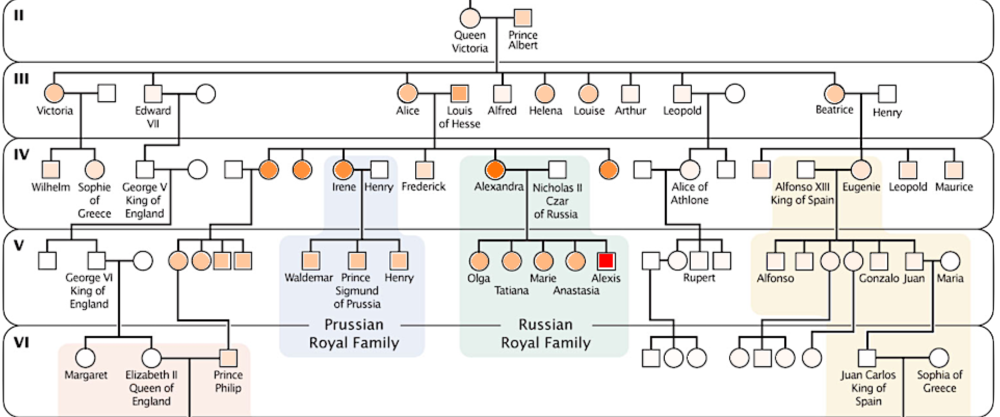

## Bloodlines (Part One)

The assignment description can be found [here](https://docs.google.com/document/d/1WCT4cLG8DxNZdXHiM2NAvv2GcEypscKOwGRSE4eJ_T8/edit?usp=sharing).

This repository contains starter code:
- `factor.py`: Code for questions one, two, and three goes in this file
- `bayes.py`: Code for question four goes in this file

It also contains code that you can use and emulate but should not change:
- `covid.py`: The Covid-19 Bayesian network discussed in class.
- `montyhall.py`: The Monty Hall Bayesian network discussed in class.
- `vampire.py`: The blood types Bayesian network discussed in class.

Ignore (but do not delete!!!) the other files in this repository.